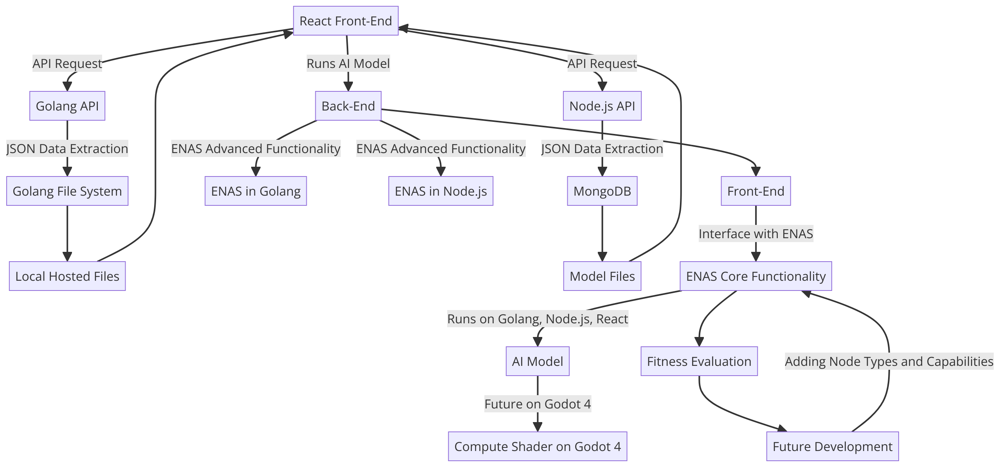
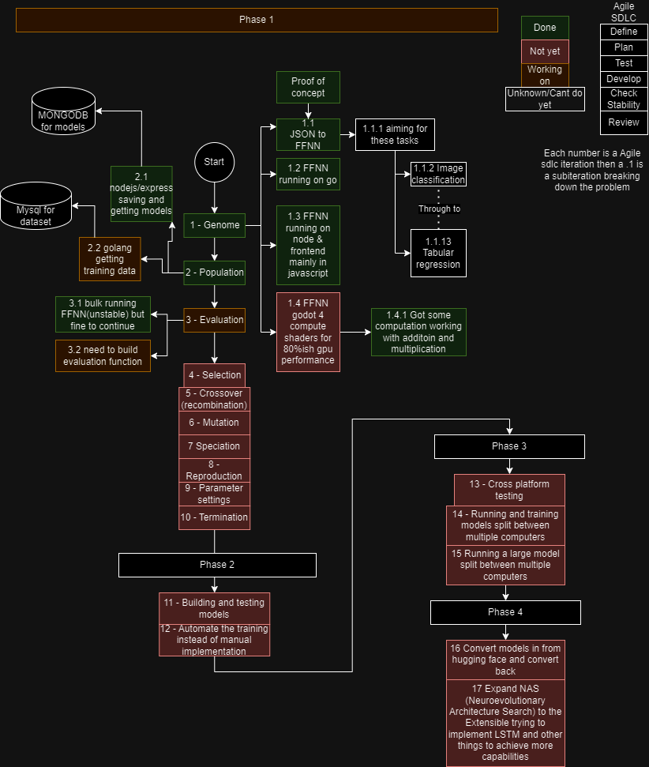

# ENAS (Extensible Neuroevolutionary Architecture Search)

ENAS is an ambitious project that aims to develop an extensible and versatile implementation of neuroevolutionary techniques for automatically discovering and optimizing neural network architectures. Inspired by the NEAT (NeuroEvolution of Augmenting Topologies) algorithm, ENAS seeks to evolve both the topologies and connection weights of neural networks simultaneously, while enabling support for a wide range of advanced node types and architectural enhancements.

The name "Extensible Neuroevolutionary Architecture Search" (ENAS) better captures the comprehensive nature of this project, as it goes beyond traditional Topology and Weight Evolving Artificial Neural Network (TWEANN) implementations. By emphasizing the extensibility, neuroevolutionary principles, and architecture search capabilities, the name reflects the project's ambitious goals and differentiates it from more limited approaches.

## Project Description

The ENAS project is designed to develop a flexible and scalable system for evolving neural networks using advanced neuroevolutionary algorithms. This system automatically discovers and optimizes neural architectures, running across multiple platforms to handle computational tasks efficiently and providing an interactive interface for users.

## System Architecture

### Components

1. **React Front-End**:

   - Initiates API requests to the Golang and Node.js APIs.
   - Runs AI models and displays the results.

2. **Golang and Node.js APIs**:

   - Handle JSON data extraction from respective sources: Golang File System and MongoDB.
   - The Golang API accesses local hosted files, while the Node.js API interacts with MongoDB to retrieve model files.

3. **Backend**:

   - Houses the core functionalities of ENAS developed in both Golang and Node.js.
   - Acts as the computational backbone where the main evolutionary algorithms operate.

4. **AI Models**:

   - Designed to run within the React front-end, Golang, and Node.js environments.
   - Future implementations will enable these models to run in a compute shader within Godot 4, leveraging GPU acceleration.

5. **Fitness Evaluation and Future Development**:
   - Includes evaluating the fitness of neural architectures and guiding their evolution based on performance metrics.
   - Future development plans include the addition of new node types and capabilities.

## Key Components and Concepts

### 1. **Genome Representation**

- **Nodes**: Represents neurons in the neural network, categorized as input, hidden, or output.
- **Connections**: Represents synapses between neurons, each with a weight and an enabled/disabled state.
- **Genes**: Each connection gene specifies the in-node, out-node, weight, its enabled state, and an innovation number for tracking historical changes.

### 2. **Population Initialization**

- Begins with minimal structures (just input and output nodes) to facilitate the evolution of complex structures over time.

### 3. **Fitness Evaluation**

- **Training and Validation Split**: Implements holdout validation where the dataset is split into training (70%) and validation (30%) segments.
- **Performance Measurement**: Each genome is evaluated on its ability to perform a given task using the training data, but its fitness is primarily determined by its performance on the validation data to ensure generalization.

### 4. **Selection**

- Uses methods like tournament selection or roulette wheel selection based on fitness to choose genomes for reproduction.

### 5. **Crossover (Recombination)**

- Combines genomes from two parents, respecting the historical origins of genes to maintain structural integrity.

### 6. **Mutation**

- **Weights Mutation**: Modifies the weights of connections to adapt and refine the network's responses to inputs.
- **Bias Mutation**: Adjusts the biases of neurons to fine-tune the activation potential, enhancing the network's ability to fit complex patterns.
- **Add Node Mutation**: Inserts a new node by splitting an existing connection, increasing the network's depth and potential for complexity.
- **Add Connection Mutation**: Creates a new connection between previously unconnected nodes, expanding the network's capacity for diverse interactions.
- **Connection Enable/Disable**: Toggles the enabled state of connections, allowing the network to experiment with different neural pathways without permanent structural changes. (Will be developed later)
- **Add Layer Mutation**: Introduces entirely new layers to the network, significantly enhancing its depth and functional complexity.
- **Activation Function Mutation**: Alters the activation function of nodes to better suit different types of data processing needs, adapting to the specific characteristics of the input data.
- **Node Type Mutation**: Switches node types (e.g., from standard neurons to LSTM units or attention mechanisms), enabling the network to handle temporal dynamics or focus on relevant input features effectively. (Will be developed later)

The disabled node and node type mutations will be added later due to their complexity, with the initial focus being on getting a working implementation.

### 7. **Speciation**

- Groups similar topologies into species to protect innovation and ensure that new structures are not immediately outcompeted.

### 8. **Reproduction**

- Selects the fittest individuals within each species for reproduction, replacing less fit individuals in the population, and encourages diversity through penalties on stagnant species.

### 9. **Parameter Settings**

- Includes mutation rates, population size, tournament size, and speciation thresholds, all needing careful adjustment based on specific problems.

### 10. **Termination**

- Ends based on satisfaction criteria like achieving a certain fitness level or after a predetermined number of generations.

## Practical Implementation Tips

- **Logging and Analysis**: Essential for tracking changes and understanding evolutionary dynamics.
- **Parallelization**: Speeds up fitness evaluations across the population.
- **Dynamic Parameters**: Adjust mutation rates and other parameters in response to evolutionary progress to maintain diversity and drive convergence.

## Conclusion

Building an implementation like ENAS requires a deep understanding of both evolutionary algorithms and neural network principles. This framework emphasizes the importance of generalization through holdout validation, ensuring that evolved networks perform well on unseen data.

## Future Development: Additional Node Types

One of the key aspects of ENAS is its extensibility, which allows for the incorporation of various advanced node types to handle diverse tasks and data modalities. Some of the planned node types to be added include:

- **Convolutional Nodes**: Introduce new node types that perform convolution operations, enabling the network to process image data or data with a grid-like structure by effectively capturing local patterns and spatial relationships.
- **Pooling Nodes**: Implement max pooling and average pooling nodes to downsample feature maps and introduce translation invariance, often used in conjunction with convolutional nodes.
- **Normalization Nodes**: Incorporate batch normalization or layer normalization nodes to stabilize the training process and improve network performance by normalizing inputs to subsequent layers.
- **Dropout Nodes**: Add dropout nodes to randomly drop out (set to zero) a fraction of activations during training, acting as a regularization technique to prevent overfitting.
- **Residual Connections**: Enable the creation of residual connections or skip connections, allowing the input of a node to be added to its output, mitigating the vanishing gradient problem and improving the training of deeper networks.
- **Embedding Nodes**: Introduce embedding nodes to map discrete input data (e.g., text or categorical features) to dense vector representations.
- **Attention Nodes**: Explore the addition of attention mechanisms, such as self-attention or multi-head attention, by introducing attention nodes to capture long-range dependencies, particularly useful for sequential data.
- **Recurrent Nodes**: Implement recurrent nodes like Long Short-Term Memory (LSTM) or Gated Recurrent Units (GRU) to enable the network to model and process sequential information effectively for tasks involving sequential data.
- **Capsule Nodes**: Investigate the incorporation of capsule nodes, a more recent development in neural network architectures, to better model spatial relationships and hierarchical representations in the data for certain types of tasks.

By introducing these additional node types and architectural enhancements, the ENAS implementation could be extended to handle a broader range of tasks, including image processing, natural language processing, and sequential data modeling, among others. However, implementing these enhancements may require significant modifications to the existing codebase, network configuration, and potentially the training process.

**Capabilities and Limitations**

The current focus of ENAS is on developing a feedforward neural network with multiple activation functions, which can handle tasks such as:

1. Image Classification
2. Object Detection
3. Image Segmentation
4. Zero-Shot Image Classification
5. Text Classification
6. Token Classification
7. Table Question Answering
8. Question Answering
9. Zero-Shot Classification
10. Feature Extraction (Image and Text)
11. Tabular Classification
12. Tabular Regression

With the planned addition of advanced node types and architectural enhancements, ENAS could potentially expand its capabilities to include tasks like:

1. Image-to-Text
2. Image-to-Image
3. Image-to-Video
4. Video Classification
5. Text-to-Video
6. Mask Generation
7. Text-to-3D
8. Image-to-3D
9. Automatic Speech Recognition
10. Audio-to-Audio
11. Audio Classification
12. Voice Activity Detection

However, there are certain tasks that may still be beyond the scope of ENAS, even with these enhancements, such as:

1. Image-Text-to-Text
2. Visual Question Answering
3. Document Question Answering
4. Depth Estimation
5. Text-to-Image
6. Unconditional Image Generation
7. Zero-Shot Object Detection
8. Text-to-Speech
9. Text-to-Audio
10. Reinforcement Learning
11. Robotics
12. Graph Machine Learning

These limitations are due to the specialized architectures or techniques required for such tasks, which may not be easily achievable within the current scope of ENAS. However, the project's focus on extensibility and architectural search leaves room for future exploration and expansion into these areas as well.

It's important to note that while the addition of new node types expands the capabilities of ENAS, the actual performance and quality of the results will depend on the specific implementation details, network architecture, training data, and hyperparameter tuning. Additionally, some tasks may require further architectural modifications or specialized components beyond the planned node types.
